<h2> 줄거리를 활용한 네이버 영화 추천에 대한 다양한 접근 방식</h2>

Konlpy를 통하여 자연어처리를 이용한 영화추천

<h3>Overview</h3>

크롤링을 통하여 데이터를 수집하고, 데이터 중 줄거리를 전처리하여 중요한 부분만 추출한 후 
접근 방식에 따른 전처리를 추가로 수행합니다. 
그 후 지정된 특정 영화에 대하여 각 접근 방식에 의해 나온 <u>유사도 값</u>, 가중치 평점, 장르 유사도 값을 가지고 
이 3가지 값을 가중치 합으로 계산하여 이것을 기반으로 값이 높은 영화들을 추천합니다. 

### Approaches

1. 키워드 기반

   전처리 된 줄거리에 대해 Textrank로 키워드들만 추출한 뒤 Word2Vec을 사용 
   유사도 값 : cosine 유사도 

2. 벡터 기반

   전처리 된 줄거리에 대해 tf-idf or count vectorizer를 적용하여 벡터로 변환 
   유사도 값 : cosine 유사도 

3. 클러스터링 기반

   전처리 된 줄거리에 대해 tf-idf vectorizer를 적용하여 벡터로 변환 후 차원 축소한 뒤 K-means 클러스터링 
   유사도 값 : 유클리디안 거리 

### Features

**가중치 평점 (Weighted rating)** 
IMDB의 방식인 weighted rating system을 사용하고 있습니다. 
이로 인해 평점은 매우 높지만 평점 참여 수가 매우 낮은 minor 영화들이 추천에 등장하는 것을 방지합니다. 

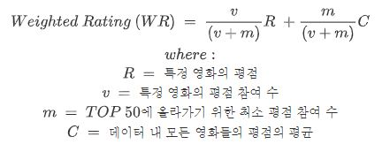

**MiniBatchKMeans** 
클러스터링 기반에서 줄거리 데이터에 대해 clustering을 사용한 후 cluster별 데이터 분포를 확인하면 
특정 cluster들에 데이터들이 쏠리는 현상이 있습니다. 
그리고 입력된 영화가 그 cluster에 속할 경우 관련 없는 영화가 포함될 확률이 커서 해당 cluster들을 피하도록 
re-clustering이 되게 했지만 대부분은 여전히 해당 cluster에 속하여 infinite loop에 빠지게 되고, 
일부는 다른 cluster로 clustering 되었지만 시간적 비용이 많이 소모되었습니다. 
그래서 기존의 Kmeans와는 달리 매 iter마다 무작위로 sampling된 데이터가 mini-batch가 되어 
centroid가 update되는 방식을 사용하는 MiniBatchKMeans를 사용하였습니다. 
그래서 기존 Kmeans보다 비교적 다양한 분포의 결과를 얻을 수 있어 대부분의 infinite loop를 해결할 수 있었고 
속도도 빨라 시간적 비용을 절약할 수 있었습니다. 
하지만, 클러스터링의 특징상 특정 입력데이터에 대해 매 실행마다 항상 동일한 결과를 보장하진 않지만 
이 알고리즘을 사용할 경우 더욱 더 보장하지 않게 됩니다. 

※ Clustering Visualization : 데이터에 대해 각 알고리즘으로 clustering을 9번 반복한 결과 
※※ KMeans 
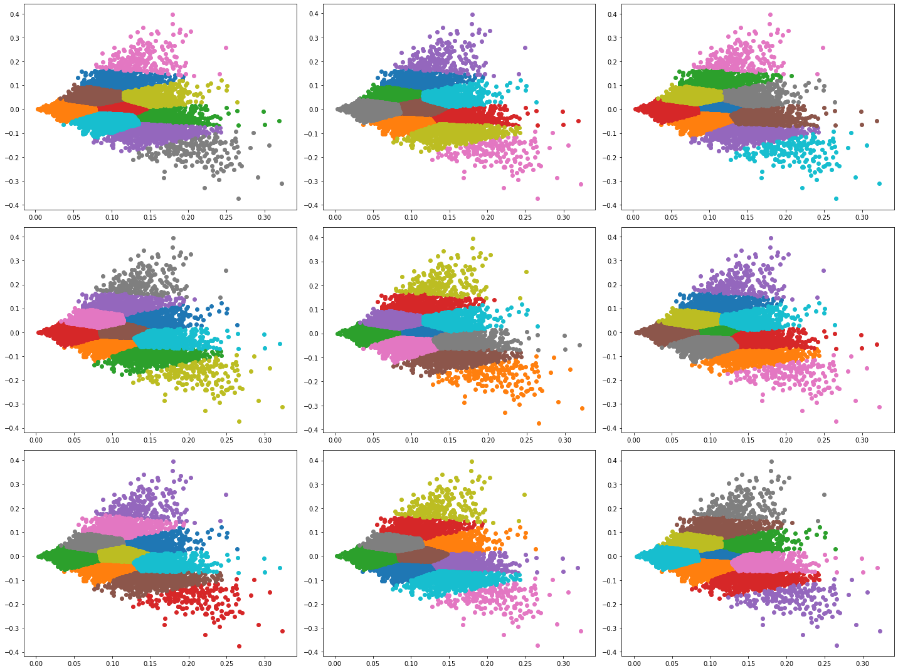

※※ MiniBatchKMeans 
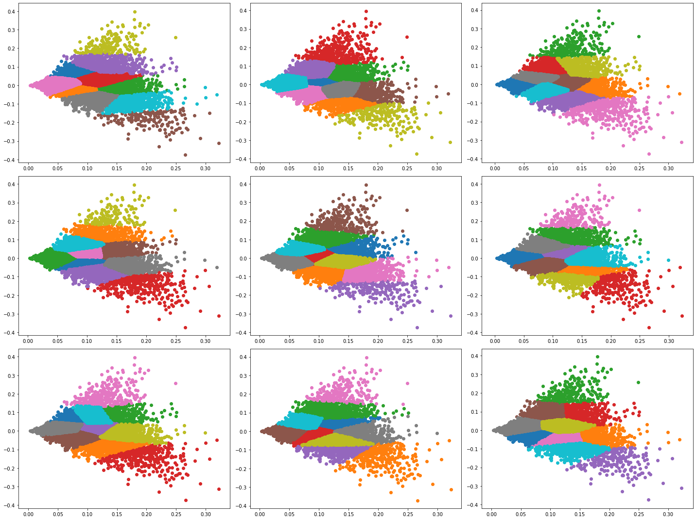

<h3>About the files</h3>

<code>naver_movie_crawler.ipynb</code> : '네이버 영화' 페이지 크롤러

<code>plot_preprocessing.ipynb</code> : 줄거리을 통해 Word2Vec, Textrank 진행

<code>movie_recommendation_by_textrank.ipynb</code> : 키워드 기반 영화 추천

<code>movie_recommendation_by_vec.ipynb</code> : 벡터 기반 영화 추천

<code>movie_recommendation_by_cluster.ipynb</code> : 클러스터링 기반 영화 추천

<code>dataset/</code> : <code>.csv</code> 형식 데이터 디렉토리

<code>model/</code> : word2vec 모델 디렉토리

<code>stopwords/</code> : 불용어 데이터 디렉토리

<h3>Data Description</h3>

- Format : /dataset/naver_movie_dataset_MMDD.csv (MMDD : 크롤러의 셀이 실행된 월,일)

- Extracted data

  - title - 영화 제목

  - genre - 장르

  - year - 개봉년도

  - date - 개봉날짜

  - rating - 평점

  - vote_count - 평점 참여수

  - plot - 줄거리

  - main_act - 주연

  - supp_act - 조연

  - page_url - 해당 페이지 링크

  - img_url - 포스터 이미지 링크

    

<h3>Recommendation System Example</h3>

- Requirement

  - Dataframe (from end of <code>plot_preprocessing.ipynb</code>)
  - Word2Vec model (from <code>plot_preprocessing.ipynb</code>)
  - Large enough RAM( Keyword extraction takes approx. 4Gb or less of JPype1 memory)
    - <code>os.environ['JAVA_OPTS'] = 'Xmx8192m'</code>(in <code>plot_preprocessing.ipynb</code>)

- Good Case

  - 포드 V 페라리 ( https://movie.naver.com/movie/bi/mi/basic.nhn?code=181710 )

    - 키워드 기반
      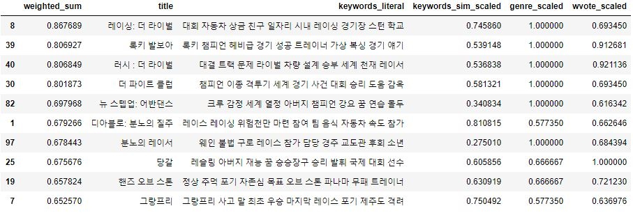

    - 벡터 기반
    
      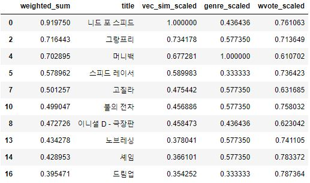
      
    - 클러스터링 기반
    
      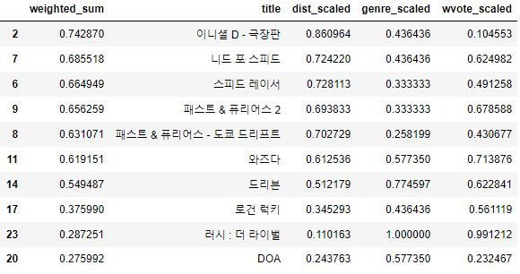

    

  - 아이언맨 2 ( https://movie.naver.com/movie/bi/mi/basic.nhn?code=49008 )

    - 키워드 기반
      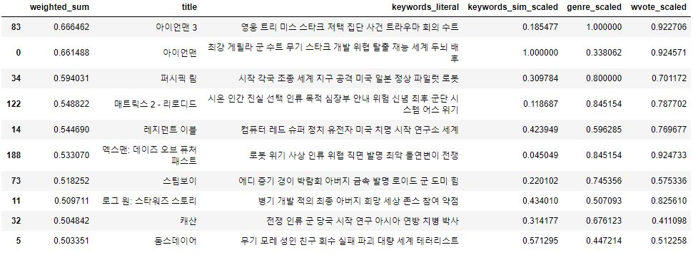

    - 벡터 기반
    
      
      
    - 클러스터링 기반
    
      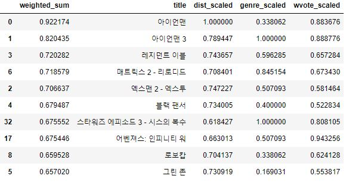
      

- Bad Case

  - 조커 ( https://movie.naver.com/movie/bi/mi/basic.nhn?code=167613 )
  
    - 키워드 기반
      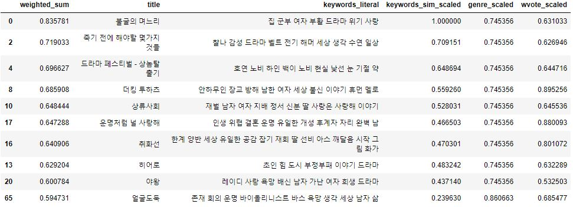
      
    - 벡터 기반
    
      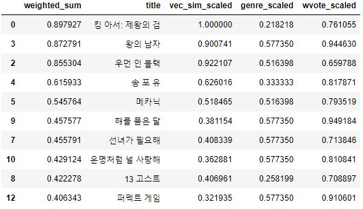
      
    - 클러스터링 기반
    
      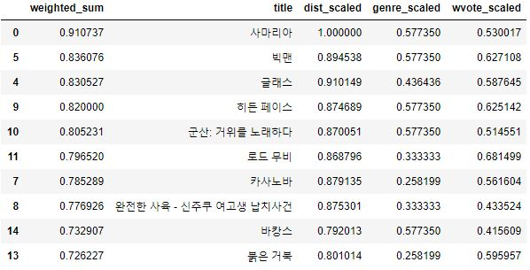
