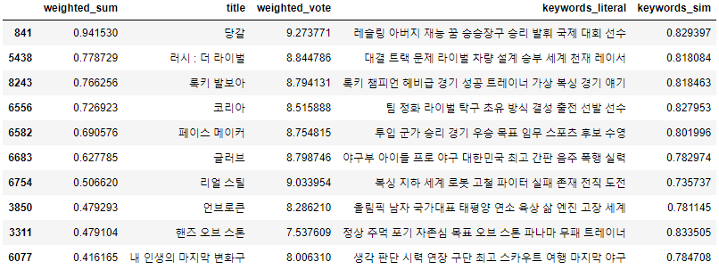
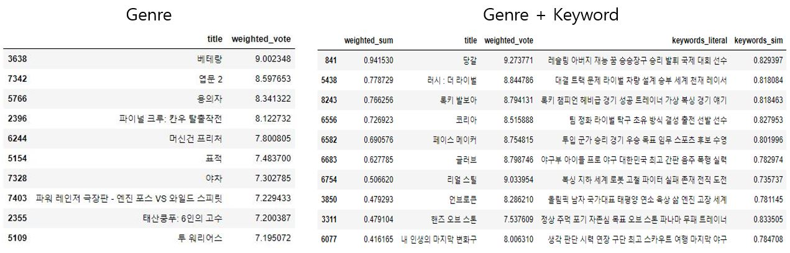
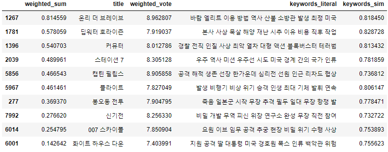
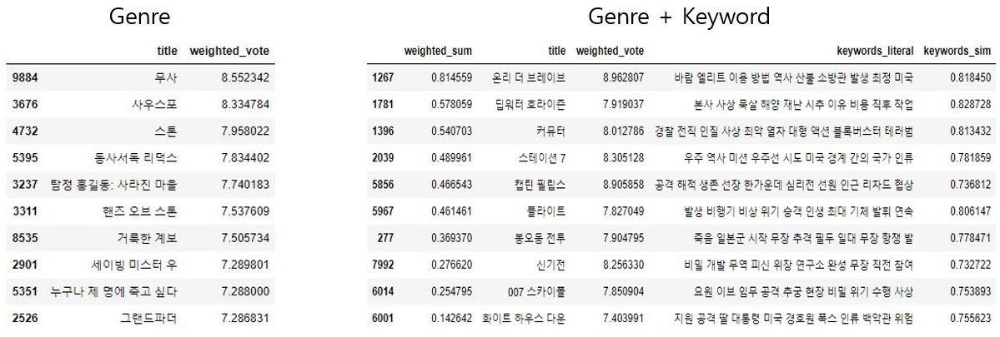
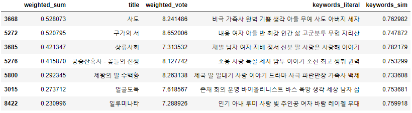

<h2> 줄거리 내 주요 키워드간 유사도 기반 영화 추천</h2>
Konlpy를 통하여 자연어처리를 이용한 영화추천

<h3>Overview</h3>

크롤링을 통하여 데이터를 수집하고, 데이터 중 줄거리를 전처리하여 모든 영화들의
줄거리에 대한 Word2Vec을 생성합니다. 
그리고 줄거리마다 Textrank를 수행하여 각 영화마다 줄거리의 주요 키워드들을 추출합니다.
그 후 한 특정 영화에 대하여 <u>많은 사용자들이 좋은 평점</u>을 남겼고 <u>장르가 비슷</u>하며, 
(Word2Vec을 기반으로 하여) <u>키워드들 간에 높은 유사도</u>를 갖는 영화들을 추천합니다

<h3>About the files</h3>

<code>naver_movie_crawler.ipynb</code> : '네이버 영화' 페이지 크롤러

<code>plot_preprocessing.ipynb</code> : 줄거리을 통해 Word2Vec, Textrank 진행

<code>movie_recommendation.ipynb</code> : 영화 추천

<code>dataset/</code> : <code>.csv</code> 형식 데이터 디렉토리

<code>model/</code> : word2vec 모델 디렉토리

<code>stopwords/</code> : 불용어 데이터 디렉토리

<h3>Data Description</h3>

- Format : /dataset/naver_movie_dataset_MMDD.csv (MMDD : 셀이 실행된 월,일)

- Extracted data

  - title - 영화 제목

  - genre - 장르

  - year - 개봉년도

  - date - 개봉날짜

  - rating - 평점

  - vote_count - 평점 참여수

  - plot - 줄거리

  - main_act - 주연

  - supp_act - 조연

  - page_url - 해당 페이지 링크

  - img_url - 포스터 이미지 링크

    

<h3>Recommendation System Example</h3>

- Requirement
  - Dataframe (from end of <code>plot_preprocessing.ipynb</code>)
  - Word2Vec model (from <code>plot_preprocessing.ipynb</code>)
  - Large enough RAM( Keyword extraction takes approx. 4Gb or less of JPype1 memory)
    - <code>os.environ['JAVA_OPTS'] = 'Xmx8192m'</code>(in <code>plot_preprocessing.ipynb</code>)
  
- Parameter
  - title : 추천의 기반이 될 영화의 제목
  - topn : 가장 유사한 장르를 가진 높은 평점의 영화 중 상위 N개의 데이터
  - thres : 키워드 유사도(range : 0 ~ 1)의 임계값(threshold)
  - data : 영화 데이터의 DataFrame

- Good Case

  - 포드 V 페라리 ( https://movie.naver.com/movie/bi/mi/basic.nhn?code=181710 )

    

    - 기존 장르기반 추천과의 비교

    

  - 백두산 ( https://movie.naver.com/movie/bi/mi/basic.nhn?code=187940 )

    
    
    - 기존 장르기반 추천과의 비교
    
    

- Bad Case

  - 조커 ( https://movie.naver.com/movie/bi/mi/basic.nhn?code=167613 )

    
